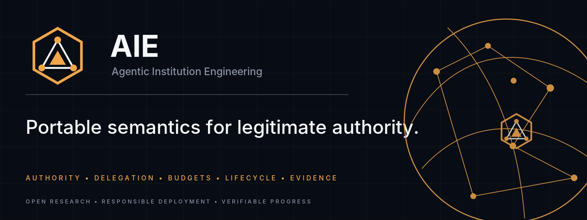
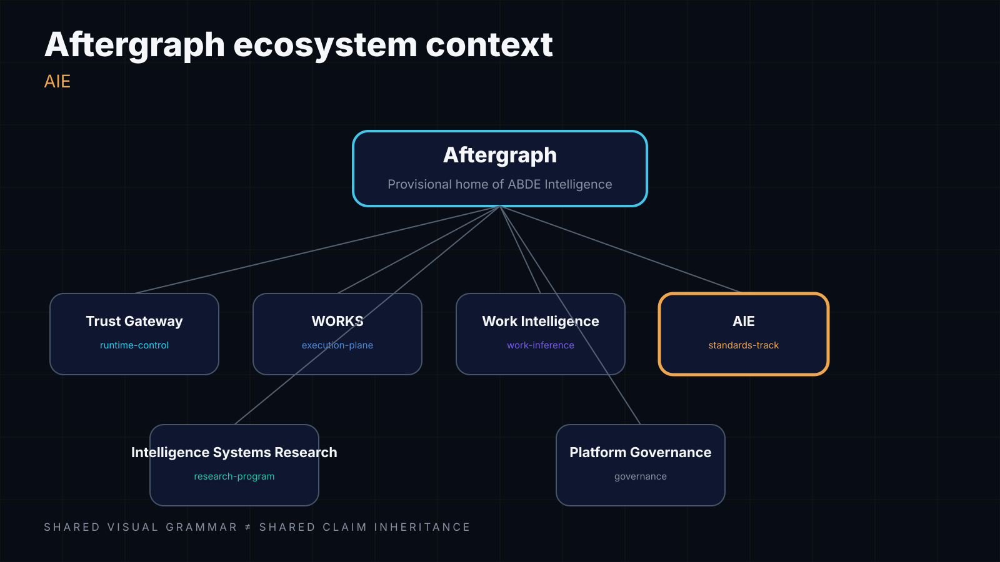
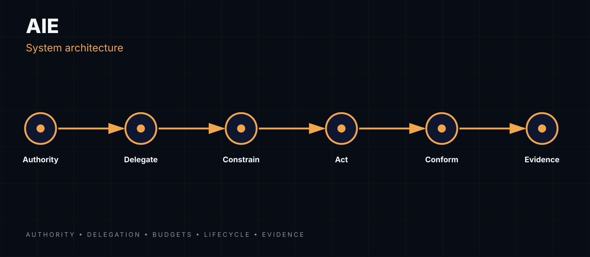
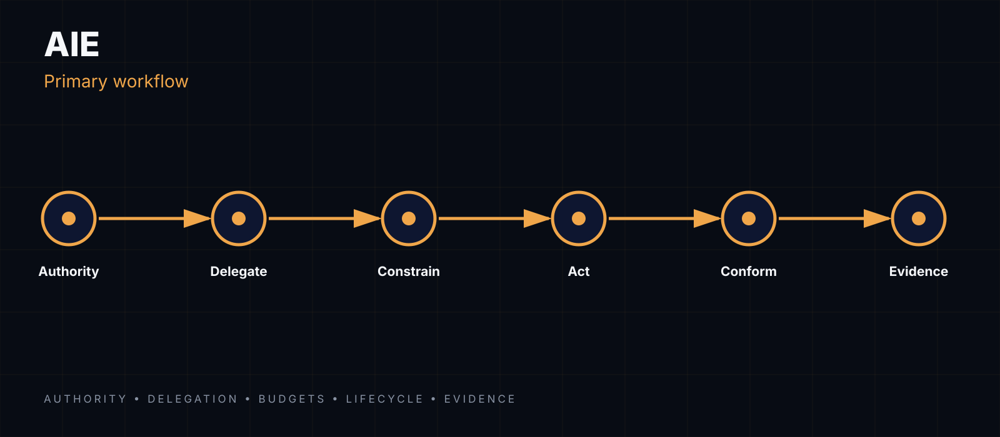

<!-- aftergraph-brand-os:v1.1.0 -->

[](https://scorecard.dev/viewer/?uri=github.com/Aftergraph/aie)

<p align="center">
  <picture>
    <source media="(prefers-color-scheme: dark)" srcset=".github/assets/github/hero.webp">
    
  </picture>
</p>

# Agentic Institution Engineering (AIE)

> AIE participates in the broader working ABDE Intelligence research/platform
> ecosystem while maintaining independent standards governance, claims,
> conformance evidence, and publication lineage. No platform claim
> automatically inherits AIE evidence.

**AIE is an experimental standards and reference-implementation project for portable authority, delegation, lifecycle, budget, revocation, and evidence semantics across agent systems.**

AIE's novelty is deliberately narrow. Broad mechanisms such as scoped permissions, external authorization, revocation, least privilege, durable agent control, and human approvals are known/existing mechanism classes across vendor control planes and agent frameworks. They are not, by themselves, AIE research claims. AIE's preserved research boundary is narrower and portable:

- portable authority/delegation semantics;
- monotonic attenuation/conservation;
- budget inheritance/conservation;
- governed topology mutation;
- cross-runtime conformance/interoperability;
- portable evidence/settlement semantics.

After Meta's September 2026 Muse release, Muse is treated as external architectural convergence for scoped permissions and external control, not as empirical reproduction of AIE results (see `evidence/s1.1/registry/prior_art_source_ledger.md` and `spec/AIE_Draft_0.3_Prior_Art_Novalty_Boundary.md`). No AIE text implies Meta independently validated AIE results.

The project explores the layer above coordination topology and runtime control:

> **Graph defines coordination. Control enforces execution. Institution resolves legitimate authority.**

Current maturity: **Draft 0.3 / v0.4-S1.1 external interoperability PASS** (run 33831755655, 2026-09-04). This repository is intentionally conservative about claims: local tests are not treated as external interoperability evidence.

## Repository boundaries

- `spec/` — normative draft artifacts and registries
- `src/` — reference implementation only
- `conformance/` — executable claim vectors
- `interop/` — external interoperability labs
- `evidence/` — release and promotion provenance
- `docs/` — research, standards basis, roadmap, and design notes
- `contracts/` — vendored cross-repo contract copies (GOV remote truth)

## Cross-repo contract resolution

Conformance tests resolve after-graph-governance contracts through
`tests/conftest.py::resolve_contracts_dir()` in this order:

1. `AGC_CONTRACTS_DIR` env var
2. side-by-side `after-graph-governance` checkout
3. vendored copy in `contracts/` (committed; re-pin with
   `bash scripts/sync-contracts.sh` against GOV remote main, `--check`
   verifies byte-identity and exits 1 on drift)

## Current promotion target

`v0.4-S1.1` has achieved external PASS (run 33831755655, 2026-09-04) with:

- live SPIRE Server + Agent
- X.509-SVID and trust-bundle rotation without gateway restart
- official MCP `2026-07-28` conformance on three paths: direct, SPIFFE bridge, and SPIFFE + AIE
- identical official check IDs across all three paths (195 checks each)
- revocation/replay enforcement without upstream execution
- privacy-minimized evidence by default
- all 4 external rotation gates PASS (svid_rotation_live, trust_bundle_rotation_live, new_trust_works, old_trust_rejected)

Evidence: `evidence/s1.1/AIE_S1_1_PROMOTION.json`, archived at `/home/nora/aie-evidence/33831755655/`.

The next promotion target beyond the S1.1/S2 closure is further external
interoperability work on supported transports and task lifecycle semantics
(see `STATUS.md` for the current promotion state and blockers).

The repository carries three execution providers:
1. **GitHub-hosted** `ci.yml` — billing-locked on the legacy personal account (startup_failure on every job). Kept as a `workflow_dispatch` rollback path.
2. **Self-hosted** `aie-v04-ci-self-hosted.yml` and `aie-v04-s1-self-hosted.yml` — run on the VDS self-hosted runner with the `aie-interop` label. Covers unit CI and the S1.1 external interop proof.
3. **Works control plane** `works.yml` — per-push verification through the avc-core pool on the VDS, published as a `works/aie` commit status. See PR #27 for context.

See `docs/s1-self-hosted-runner.md` for the self-hosted runner setup.

## Prior-art and novelty posture

AIE's novelty is deliberately narrow. Broad mechanisms such as scoped permissions, external authorization, revocation, least privilege, durable agent control, and human approvals are known/existing mechanism classes and are not promoted as AIE research claims. AIE's preserved research boundary is narrower and portable. See `evidence/s1.1/registry/prior_art_source_ledger.md` and `spec/AIE_Draft_0.3_Prior_Art_Novalty_Boundary.md`.

## System visuals

Real architecture diagrams (repo-specific, source in `.github/assets/architecture/`):

<p align="center">
  
  <br><em>System context</em>
</p>

<p align="center">
  
  <br><em>Architecture</em>
</p>

<p align="center">
  
  <br><em>Primary workflow</em>
</p>

## Local verification

```bash
python -m pip install -e '.[dev,otel]'
pytest -q
```

The **173-test repository baseline** includes the S2 A2A-preparation targeted suite (16/16 tests passing). S2 remains preparation-only and does not satisfy the external interoperability gate.

## Status

Research thesis → Draft specification → two runtimes → conformance → durable gateway → real trust/forwarding → external interoperability closure (S1.1 PASS, 2026-09-04) → **A2A interop (next)**.

See `evidence/s1.1/registry/walkthrough.md` for the end-to-end S1.1 promotion walkthrough.

## License

Apache-2.0.

---

**Brand status:** Aftergraph / ABDE Intelligence are PROVISIONAL — NOT TRADEMARK CLEARED. No irreversible branding until clearance.
